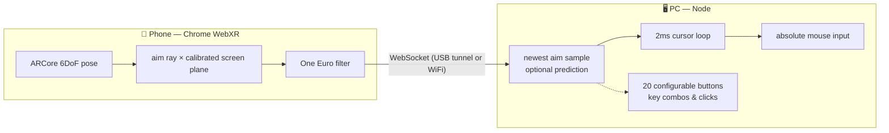

<div align="center">

# 🔫 point-bang

**Your phone is the lightgun.**

Turn any ARCore Android phone into a drift-free lightgun for PC rail shooters —
WebXR aim tracking in the browser, absolute mouse input on the desktop.
No custom hardware. No markers. No sensor bars.

[](https://github.com/ggcaponetto/point-bang/actions/workflows/ci.yml)
[](https://ggcaponetto.github.io/point-bang/)
[](LICENSE)
[](https://nodejs.org)

**[📖 Documentation](https://ggcaponetto.github.io/point-bang/)** ·
[Getting Started](https://ggcaponetto.github.io/point-bang/guide/getting-started) ·
[API Reference](https://ggcaponetto.github.io/point-bang/api/)

</div>

---

## How it works



ARCore's visual-inertial tracking gives **absolute, drift-corrected aim at
gyro-class latency** (~15–30ms phone-side) — the camera corrects the IMU, so
there's no yaw drift and no recentering. You calibrate once per session by
pointing at three screen corners; WebXR anchors keep the calibration
self-correcting as ARCore refines its map of your room.

## Quick start

```sh
git clone https://github.com/ggcaponetto/point-bang.git
cd point-bang
npm install
npm run start:adb    # USB flow: sets up the adb tunnel for you
```

Open **http://localhost:8443** in Chrome on the phone, tap **START AR**,
capture the three corners — the PC cursor follows your aim.

No cable? `npm run start:wifi` prints the URLs for same-network play, and
`npm run start:tunnel` exposes a public HTTPS URL through ngrok — a secure
context, so WebXR works from any network with no certificates and no Chrome
flags (setup convenience, not a low-latency play transport).
Full setup, calibration and WiFi/HTTPS details:
**[Getting Started →](https://ggcaponetto.github.io/point-bang/guide/getting-started)**

### Or skip Node entirely

`npm run build:sea` produces a single self-contained executable —
`dist/point-bang` on Linux, `dist/point-bang.exe` on Windows — with the phone
page and the input driver baked in. Copy it anywhere:

```sh
point-bang serve --mode adb --port 8443
point-bang tunnel           # public HTTPS URL, alongside a running serve
point-bang check            # is this install working?
point-bang wifi             # 2.4 or 5 GHz?
point-bang --help
```

## Highlights

- 🎯 **Absolute aim, no drift** — WebXR `immersive-ar` with anchor-pinned,
  self-correcting calibration; two-ray fallback for hard-to-track screens.
- ⚡ **Latency-obsessed** — One Euro filtering phone-side, a 2ms newest-wins
  cursor loop, zeroed input-driver delays, optional aim extrapolation
  (`--predict-ms`, off by default), and live p50/p95 jitter stats to prove it.
- 🕹️ **20 assignable buttons** — one JSON file maps on-screen buttons to any
  key combo or mouse button, press-and-hold included, and places each one
  anywhere on the screen (default: big LEFT/RIGHT click halves plus A/B).
  FIRE itself is just a remappable button.
- 🎚️ **Tunable feel** — smoothing↔snappy slider (100% = raw aim), aim-offset
  nudge pad, `--predict-ms` lookahead control.
- 🌍 **Play-anywhere setup path** — `--tunnel ngrok` publishes an HTTPS URL the
  phone can open from any network, WebXR secure context and `wss://` aim
  stream included, with no certificates to install.
- 👀 **Runs headless** — no display (container, CI, SSH)? `serve` prints the
  aim instead of moving a cursor rather than dying on X11; `--input none`
  forces it anywhere.
- 🖥️ **Windows and Linux, equally** — one yargs CLI, no environment-variable
  syntax that only bash understands, band detection via `netsh`/`nmcli`/`iw`,
  and CI that runs the whole suite on both.
- 🧰 **Zero build steps to develop** — TypeScript runs natively on Node ≥ 23.6
  and the phone page is buildless ES modules; the only build is the optional
  single-executable one.
- 🧪 **Seriously tested** — 218 tests, 90%+ coverage enforced on every
  metric, integration tests with fake input devices, prettier/knip/husky
  gates.

## Project status

Working proof of concept — calibrate, aim, shoot works end-to-end over USB
and WiFi. On the [roadmap](https://ggcaponetto.github.io/point-bang/reference/architecture):
a measurement harness (accuracy/drift reports), WebRTC DataChannel for
unordered low-latency WiFi, MAME/RetroArch integration testing, and
multi-gun support.

## Contributing

PRs welcome. `npm run validate` must pass (formatting, types, dead code,
tests with 90% coverage) — husky enforces it on push. See
[Development](https://ggcaponetto.github.io/point-bang/reference/development)
for commands and conventions.

## License

[MIT](LICENSE) © 2026 ggcaponetto
