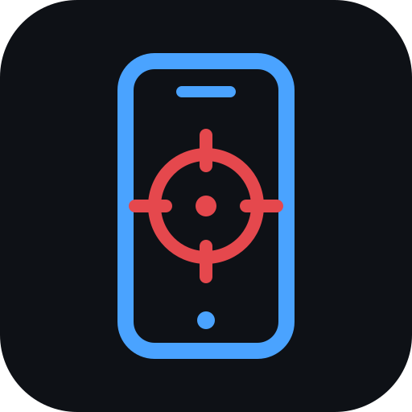
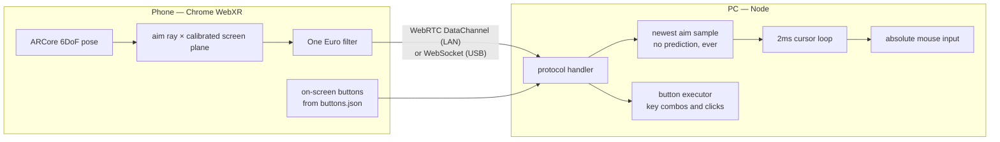

<div align="center">



# point-bang

**Your phone is the lightgun.**

Turn any ARCore Android phone into a drift-free lightgun for PC rail shooters —
WebXR aim tracking in the browser, absolute mouse input on the desktop.
No custom hardware. No markers. No sensor bars.

[](https://github.com/ggcaponetto/point-bang/actions/workflows/ci.yml)
[](https://ggcaponetto.github.io/point-bang/)
[](https://codecov.io/gh/ggcaponetto/point-bang)
[](https://sonarcloud.io/summary/new_code?id=ggcaponetto_point-bang)
[](https://github.com/ggcaponetto/point-bang/releases)
[](LICENSE)
[](https://nodejs.org)

**[Start here (players)](https://ggcaponetto.github.io/point-bang/start/)** ·
[Documentation](https://ggcaponetto.github.io/point-bang/) ·
[API Reference](https://ggcaponetto.github.io/point-bang/api/)

</div>

---

<div align="center">

## ❤️ A note from a tired, happy dad

There's a little boy in the next room who thinks his dad makes video
games. The truth is his dad chases calibration bugs at midnight and
whispers "one more build" while other people whisper goodnight.

I made point-bang because arcades made my childhood magical, and I
wanted to hand that feeling to my son and share it for free to strangers  
on the internet.

The hours in this repo came from somewhere — a
coffee can't buy them back — but it turns them into something I can
show him one day and say: _look, buddy, it mattered. People played
because of us._

If point-bang made you feel eight years old again, even for one
evening — the yellow button below is how you say it.

[](https://www.buymeacoffee.com/ggcaponetto)

</div>

---

## Getting started (players)

No Node, no build tools, no certificates — three steps:

1. **Check your phone** — open
   **[the start page](https://ggcaponetto.github.io/point-bang/start/)** on
   your Android phone; it tells you on the spot whether WebXR AR is
   supported (and how to fix it if not).
2. **Run point-bang on the PC** — download the single executable for
   Windows or Linux from
   [Releases](https://github.com/ggcaponetto/point-bang/releases) and run
   it. It prints a QR code. (Windows: accept the firewall prompt for
   private networks.)
3. **Scan, allow, play** — scan the QR with the phone, tap **Allow** on
   Chrome's one-time local-network prompt, calibrate on your three screen
   corners, and the PC cursor follows your aim. Aim data flows over a
   WebRTC DataChannel directly across your WiFi.

Then set up an actual game — the **[game guides
→](https://ggcaponetto.github.io/point-bang/guide/games/)** walk
through Time Crisis in DuckStation. Prefer a
cable? The [USB flow](https://ggcaponetto.github.io/point-bang/guide/getting-started)
has the lowest jitter of all and charges the phone while you play.

Alternatively, you can skip setting up a game and just move the PC cursor around with your phone to test the aim.

## Getting started (developers)

Requires Node ≥ 23.6 (TypeScript runs natively via type stripping — no
build step anywhere in the dev loop):

```sh
git clone https://github.com/ggcaponetto/point-bang.git
cd point-bang
npm install
npm run start:adb    # USB flow: sets up the adb tunnel for you
```

Open **http://localhost:8443** in Chrome on the phone, tap **START AR**,
capture the three corners. `npm start` additionally prints the QR for the
wireless flow, `npm run start:tunnel` exposes a public ngrok URL, and the
[development guide](https://ggcaponetto.github.io/point-bang/reference/development)
covers testing the remote flow against uncommitted code.

```sh
npm run validate     # format:check + typecheck + knip + tests (90% coverage gate)
npm run build:sea    # single self-contained executable -> dist/point-bang[.exe]
node cli.ts --help   # every option is a flag
```

### How it works



ARCore's visual-inertial tracking gives **absolute, drift-corrected aim at
gyro-class latency** (~15–30ms phone-side) — the camera corrects the IMU, so
there's no yaw drift and no recentering. You calibrate once per session by
pointing at three screen corners; WebXR anchors keep the calibration
self-correcting as ARCore refines its map of your room. The wireless setup
needs **zero certificates**: the phone page is hosted over HTTPS, signaling
is one Local-Network-Access fetch, and WebRTC brings its own encryption.

## Highlights

- **Absolute aim, no drift** — WebXR `immersive-ar` with anchor-pinned,
  self-correcting calibration; two-ray fallback for hard-to-track screens.
- **Scan-to-play wireless setup** — the startup QR loads the hosted page
  over HTTPS and connects a WebRTC DataChannel straight across the LAN via
  Chrome's Local Network Access permission: zero certificates, zero flags,
  zero accounts (Chrome 142+).
- **Latency-obsessed** — One Euro filtering phone-side, a 2ms newest-wins
  cursor loop, zeroed input-driver delays, no prediction or lookahead of any
  kind (the cursor is exactly where the phone last said the aim was), and
  live p50/p95 jitter stats to prove it.
- **20 assignable buttons** — one JSON file maps on-screen buttons to any
  key combo or mouse button, press-and-hold included, places each one
  anywhere on the screen, and gives each a tunable haptic tick on press.
  The trigger is just button `b0` — remappable like everything else.
- **Off-screen gestures & real triggers** — assign any button to a screen
  edge (aim past it to press, back on screen to release — the classic
  Time Crisis reload/duck), and map Bluetooth gamepad or clicker buttons
  to any action via the Gamepad API; the HUD shows each physical press's
  button index so any device is easy to map.
- **Live button editor** — the server hosts a drag-and-drop editor
  (`/editor.html`, URL in the startup banner): move and resize buttons on a
  phone-shaped canvas, remap keys, tune haptics — Save applies instantly,
  the PC remaps without a restart and a connected phone re-renders
  mid-session without recalibrating.
- **Multi-monitor aware** — `point-bang monitors` lists your displays;
  `--monitor 2` aims at one of them, `--monitor all` spans the whole
  desktop with each monitor calibrated as its own plane (bezels and
  angled panels stay accurate, with independent aim correction per
  monitor), and the default stays the primary screen. During calibration
  the PC cursor jumps to the monitor you should aim at next, and if you
  still calibrated them in the wrong order, one tap on SWAP in the aim
  panel fixes the assignment — no recalibration. (X11 multi-monitor
  setups that relied on the old implicit span: that is `--monitor all`
  now.)
- **Pause hotkey** — `shift+space` pauses tracking so the real mouse
  works, and resumes right where you left off; configurable, and never
  swallows the combo from the focused game.
- **Windows and Linux, equally** — one yargs CLI, no bash-only syntax,
  CI runs the whole suite on both.

## Project status

Working end-to-end: calibrate, aim, shoot — over USB, WiFi (QR → WebRTC),
or an ngrok tunnel. On the
[roadmap](https://ggcaponetto.github.io/point-bang/reference/architecture):
a measurement harness (accuracy/drift reports), MAME/RetroArch integration
testing, and multi-gun support.

## Contributing

PRs are very welcome — including **community guides, hacks and mods**,
which get linked from the docs. Read
[CONTRIBUTING.md](CONTRIBUTING.md) for setup, the `npm run validate` gate
and commit conventions, and mind the [Code of Conduct](CODE_OF_CONDUCT.md).

## License

[MIT](LICENSE) © 2026 ggcaponetto
