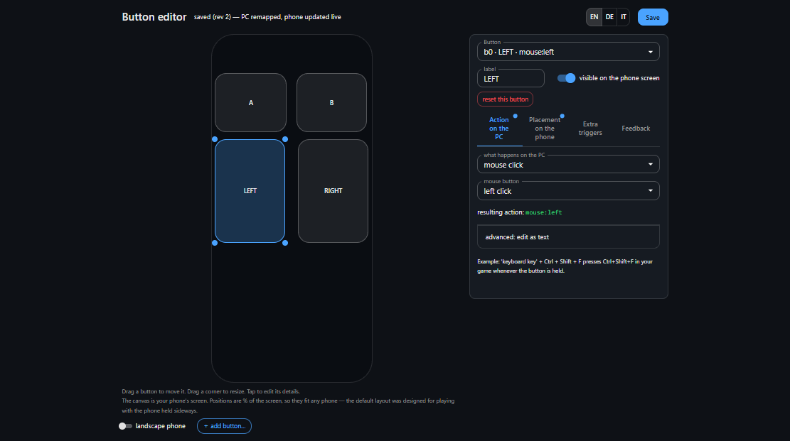
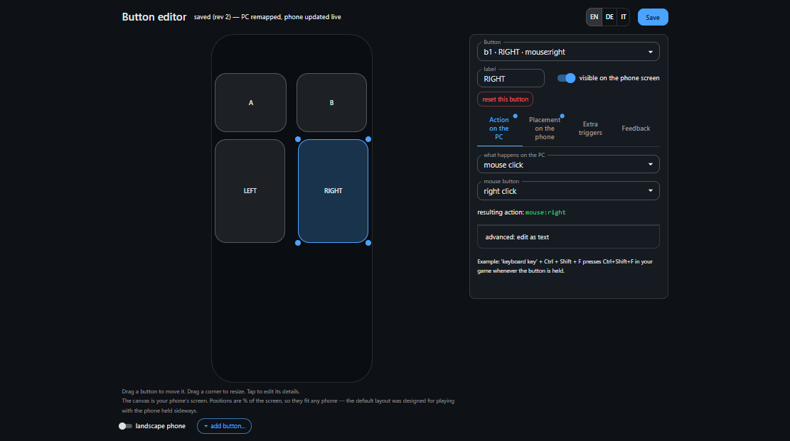
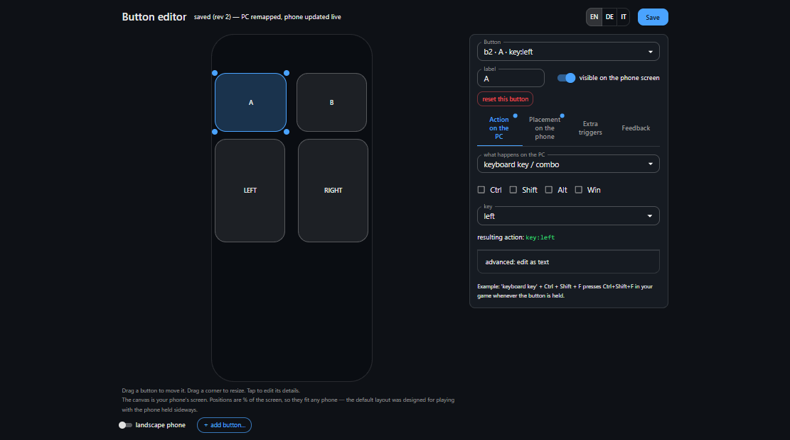
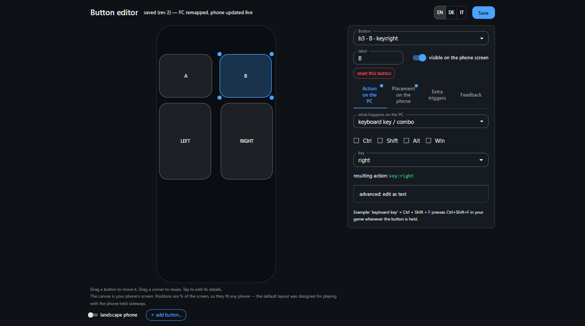
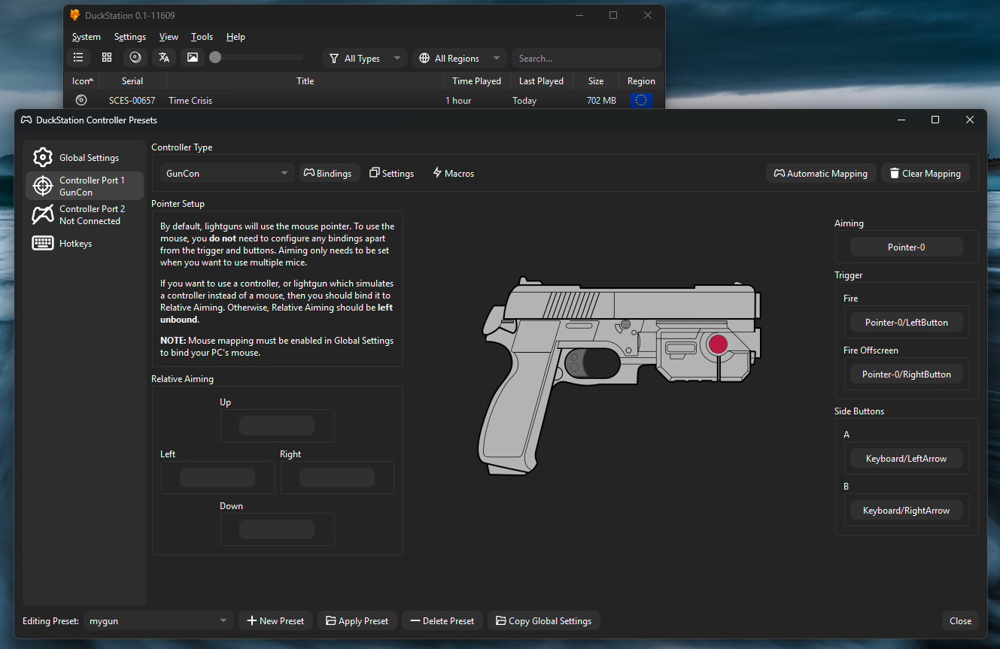

# Time Crisis (DuckStation)

From zero to shooting in **Time Crisis** (PlayStation) with your phone as
the lightgun, using the [DuckStation](https://www.duckstation.org/)
emulator. DuckStation's GunCon controller reads the **mouse pointer
position** — exactly what point-bang injects — so the whole setup is four
phone buttons and one controller preset.

How the pieces map, end to end:

| Phone button | point-bang action | DuckStation GunCon | In the game     |
| ------------ | ----------------- | ------------------ | --------------- |
| **LEFT**     | `mouse:left`      | Fire               | Shoot           |
| **RIGHT**    | `mouse:right`     | Fire Offscreen     | Reload / duck   |
| **A**        | `key:left`        | Side button A      | Start / confirm |
| **B**        | `key:right`       | Side button B      | Back / pedal    |

> 📹 _Videos showing the full setup and gameplay are coming soon and will be
> embedded here._

## 1. Set up the PC (once)

1. Download the latest `point-bang` executable for Windows or Linux from
   [Releases](https://github.com/ggcaponetto/point-bang/releases) — a single
   file, nothing to install. (Developers can clone the repo and `npm start`
   instead.)
2. Run it. On Windows, **accept the firewall prompt for private networks** —
   dismissing it silently breaks the WiFi flow.
3. The terminal prints a QR code and the button-editor URL. Leave it running.

## 2. Set up the phone (once)

- Android phone with ARCore support and up-to-date **Chrome**.
- Install **Google Play Services for AR** from the Play Store (many phones
  already have it).
- Not sure your phone qualifies? Open the
  [start page](https://ggcaponetto.github.io/point-bang/start/) on it — it
  checks WebXR support right there.

## 3. Connect and calibrate

1. Scan the QR with the phone camera and open the link.
2. Chrome asks once to _"look for and connect to devices on your local
   network"_ — tap **Allow**. The HUD's `link` field turns `rtc`.
3. Tap **START AR**, sweep the phone slowly around the desk until tracking
   shows `good`, then aim the crosshair at your **top-left, top-right, and
   bottom-left** screen corners (that exact order), pressing **CAPTURE** on
   each. The aspect check turns green when the calibration is sane.
4. Aim at the screen — the PC cursor follows. You are now a lightgun.

Two tips before launching the game:

- Recalibration takes ~15 seconds and is needed once per session (or after
  bumping the monitor).
- Press **shift+space** on the PC keyboard any time to pause tracking and
  use the real mouse; press it again to resume.

## 4. Phone buttons

Open the **button editor** on the PC — the URL is in the startup banner
(`http://localhost:8443/editor.html`). Changes apply the moment you hit
**Save**: the PC remaps and the phone re-renders mid-session, no restart, no
recalibration.

The default layout already has the two big click buttons. For Time Crisis,
point the two small top buttons at the arrow keys so they can drive the
GunCon's side buttons:

- **LEFT** stays `mouse:left` — this is the trigger:

  

- **RIGHT** stays `mouse:right` — DuckStation will turn it into the
  off-screen shot, which in Time Crisis means **reload / take cover**:

  

- **A** → _Action on the PC_ → **keyboard key / combo** → key `left`:

  

- **B** → same, key `right`:

  

::: tip The arcade reload
Prefer ducking the way the arcade intended — by pointing the gun away from
the screen? Select the **RIGHT** button, open **Extra triggers**, and set
_off-screen edge_ to **any edge**: aiming past any side of the screen now
presses it (reload/duck), and aiming back on screen releases it. No tap
needed.
:::

## 5. DuckStation: the GunCon preset

In DuckStation, open **Settings → Controllers**, select **Controller
Port 1**, and set the controller type to **GunCon**. Then bind (or click
**Automatic Mapping** for the pointer part and add the rest):

- **Aiming** → `Pointer-0` (the mouse — note the hint in the panel:
  _Mouse mapping must be enabled in Global Settings_).
- **Fire** → `Pointer-0/LeftButton` — the phone's LEFT button.
- **Fire Offscreen** → `Pointer-0/RightButton` — the phone's RIGHT button:
  DuckStation fires one shot with the aim forced off-screen, which Time
  Crisis reads as reload/duck.
- **Side Buttons A / B** → `Keyboard/LeftArrow` and `Keyboard/RightArrow` —
  the phone's A and B buttons.
- Leave **Relative Aiming** unbound — point-bang provides absolute aim.

Saving it as a **preset** (bottom bar) keeps the bindings reusable across
games:

## 6. Play

1. Run the game **fullscreen on the calibrated monitor**. Windowed play is
   not supported yet (the PC maps aim to the whole screen; per-window
   mapping is on the roadmap).
2. In the game's own calibration screen, shoot the targets it shows —
   GunCon games calibrate themselves once and remember it.
3. Enemies pop up — LEFT to shoot, RIGHT (or an off-screen flick, if you
   set the edge trigger) to duck and reload.

> 📹 _Gameplay video placeholder — Time Crisis 1, USB flow, 60fps._

### If shots land slightly off

- Nudge the aim with the on-phone **adjust pad** (arrows shift the aim in
  0.5% steps).
- Recalibrate with more deliberate corner captures.
- Check the [latency guide](/guide/latency) — enable the monitor's game
  mode and exclusive fullscreen; the display+game pipeline usually
  dominates end-to-end latency.

---

Looking for other games? Back to the [game guides](../).
